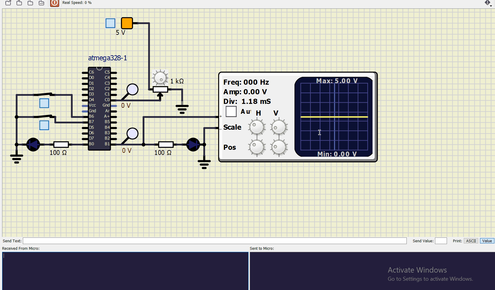

# Car Seat heater- Embedded C- Pallavi Sharma (257471)

## Project Description

This project implements the idea of a Car seat-heater temperature monitoring system. When a passenger is enters and seats inside a car and switches on the seat heater, the temperature sensor gets activated and starts sending the analog temperature values to ATMEGA328 microcontroller. These values are then displayed on a serial monitor using UART data transmission protocol. 

This project is basically broken into 4 separate modules. The functionality of each module is defined:

*  Activity 1: Activating the temperature sensor when both conditions; passenger is seated inside the car and seat-heater is turned ON; are true.
*  Activity 2: Implementation of Analog-to-Digital converter to did=gitize analog values received from the temperature sensor.  
*  Activity 3: Representation of Temperature values using Pulse Width Modulation in an oscilloscope.
*  Activity 4: Display of temperature data on a serial monitor with the help of UART data transmission protocol.

## Simulation

### Activity 1

### Activity 2

### Activity 3

### Activity 4

## Integration of all Activies

### Car seat-heater System - ON

### Car seat-heater System - OFF

## Code Quality and Continuous integration 

| Build | Codacy | CppCheck |
|:-------:|:-------:|:------:|
|  |  |  | 
